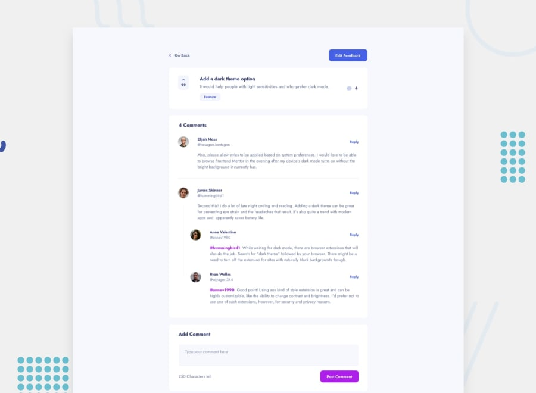
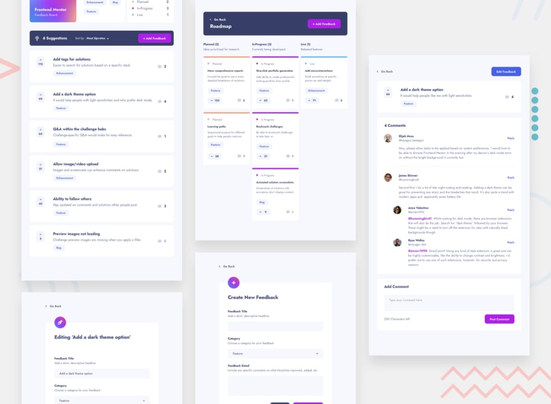
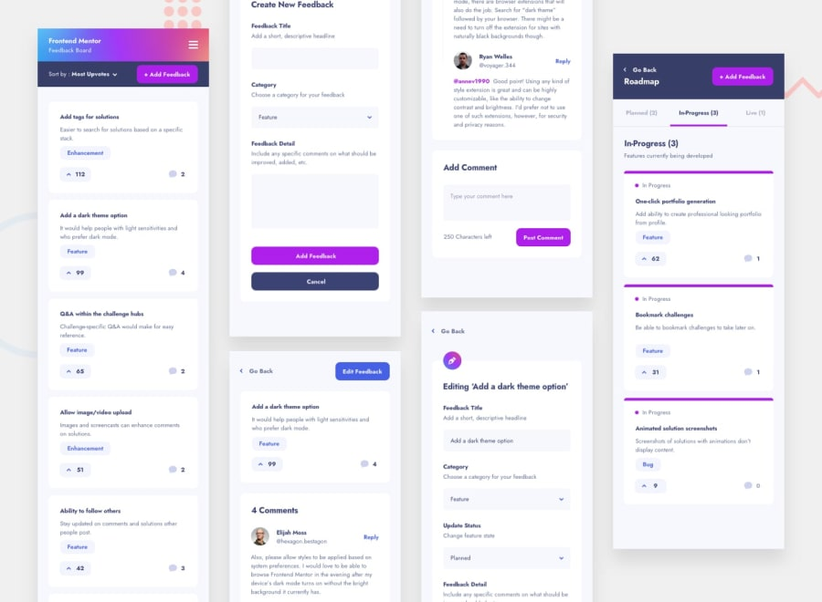
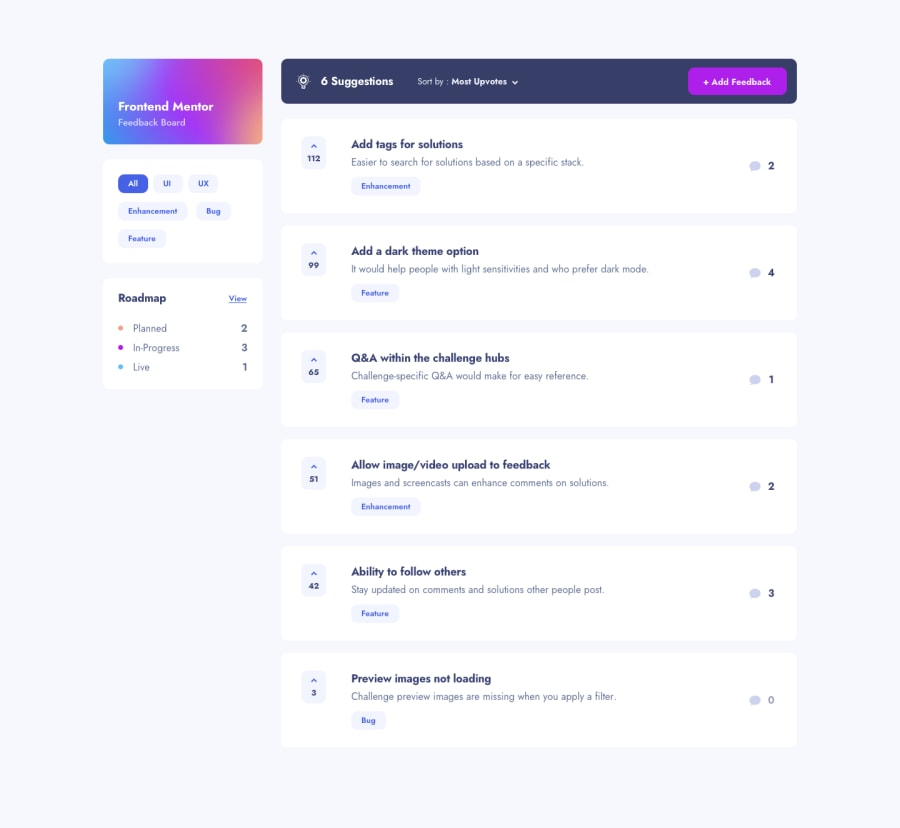
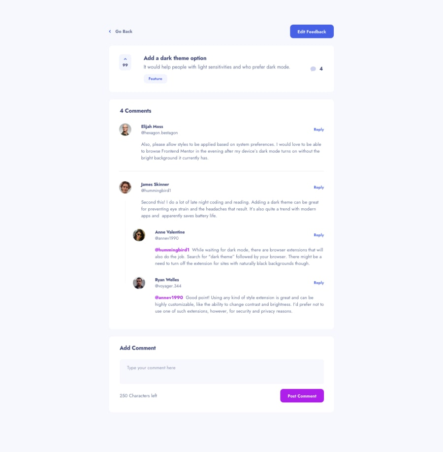
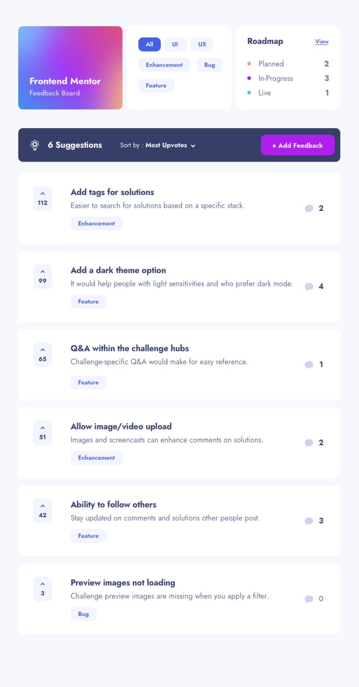
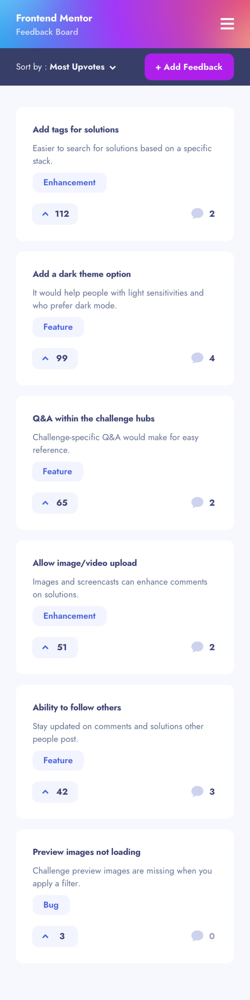

Feedback app
===========

Bale Feedbacks App(bug reporting)
[on Frontend mentor](https://www.frontendmentor.io/challenges/product-feedback-app-wbvUYqjR6)
# لیست کارها و ویژگی‌ها

- ایجاد ساختار Routing شامل Routeهای زیر

  - /signup
  - /login
  - /board
  - /issues
  - /issues/:issueId
  - /issues/new
  - /issues/:issueId/edit

  به صورت پیشفرش کاربر باید صفحه‌ی /issues را مشاهده کند

  در صورتی که کاربر قصد انجام کاری (اضافه کردن باگ یا پیشنهاد یا نظر گذاشتن و...) باید به صفحه‌ی ورود هدایت شود.

  در صورتی که کاربر وارد شده بود اگر به Route /login یا /signup رفت باید به صفحه‌ی قبلی که بوده باید به صفحه‌ی اصلی هدایت شود.

- پیاده سازی صفحه‌ی اصلی

  - مشاهده موضوعات با فیلترهای پیشفرض
  - بارگزاری موضوعات هنگام اسکرول به پایین صفحه
  - رای دادن به موضوعات
  - مرتب سازی براساس تاریخ، تعداد رای، تعداد نظر
  - فیلتر براساس وضعیت، نوع، برچسب‌های موضوعات

- پیاده سازی صفحه‌ی یک موضوع

  - نمایش کامل موضوع به همراه جزئیات
    - پیشنمایش تصاویر و ویدیوها
    - بزرگنمایی تصاویر و ویدیوها
    - امکان دانلود
  - نمایش نظرات
  - بارگزاری نظرات هنگام اسکرول

- ارسال یک موضوع
  - ارسال مجدد در صورت بروز خطا
- ارسال نظر

  - ارسال مجدد در صورت بروز خطا

- پیاده‌سازی صفحه‌ی board

- ارسال فایل برای موضوع و نظر جدید

  - انتخاب و ارسال چند فایل (ترتیبی)
  - نمایش درصد در حال آپلود
  - ارسال مجدد در صورت بروز خطا

- صفحه‌ی پروفایل
  - ویرایش نام
  - تغییر رمز عبور

## ویژگی های مورد نیاز برای مدیر

- crud برچسب ها
- بررسی و انتشار موضوعات دریافت شده

- حذف موضوعات
- تغییر وضعیت یک موضوع
  - در صفحه ی موضوع
  - به صورت DnD در صفحه‌ی board
- صفحه‌ی تعیین دسترسی کاربر
  باید با جستجو یک کاربر را پیدا کند و دسترسی اون را تغییر دهد.
  

